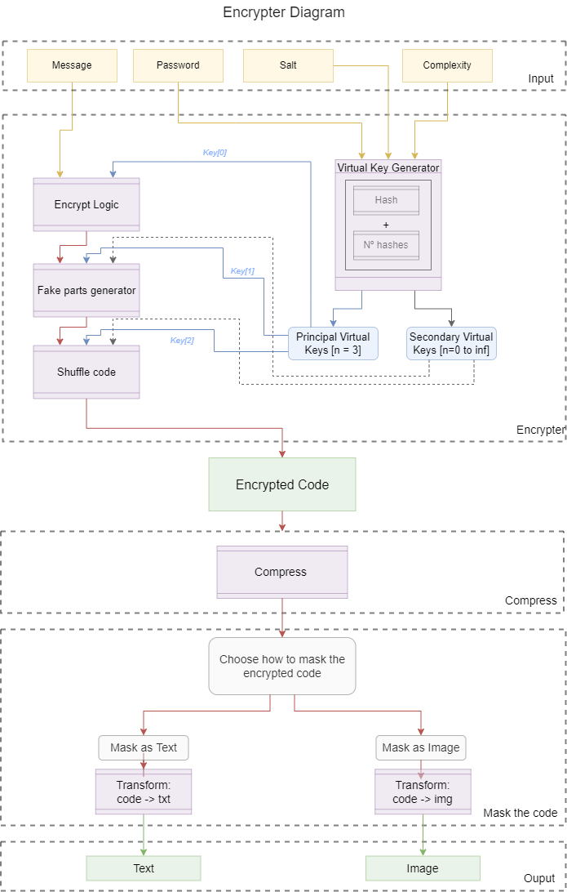

# hash_encrypter
(Project at work. In a close future, the description will be better elaborate here.)   

<a href='https://bernp.github.io/hash-encrypter/' target="_blank">Click here to access the website!<a>  

<h3>Proposal:</h3>
Make a method that can create an Encrypter by a generalist approach - in other words, develop a method that can be replied to create an infinite number of encryption functions. Thus, by using this generic approach, develop an Encrypter that can hide the encrypted code in phrases or in images. Therefore, the Encrypter will be developed, at first, as a website and, after all the tests are conducted, be converted into a smartphone app. 

<h3>Final objective:</h3>
Make an app that can be easily used to hide messages and photos in a way that masks that was encrypted - an ordinary person that sees the encrypted message or photo can’t even notice that it has some code hidden there. 

<h3>Project current stage:</h3>
At the moment, the project can receive an input, encrypt it and compressed it (it can be easily visualized with the encryption diagram image below). The input just can be a text - what in future will be any file type - and the output is a compacted version of an integer sequence.
The mask function - that transform the compressed code into an image or text, what impossibility an outsider individual to link the output to a possible hided message - was just passed through the theory phase (already know how it will be done), but not started the code write phase (no code about this part was done).   

