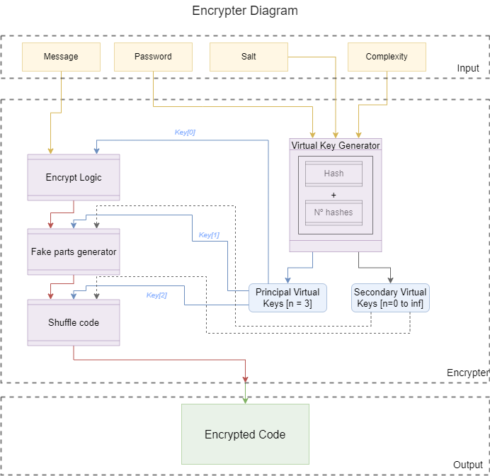

# hash_encrypter
(Project at work. In a close future, the description will be better elaborate here.)  

<b>Observation: The code that was post is a prototype, that was at first design to small message as input. But for the objectives of this project, the algorithm needs scalability, what is at the current moment in the main focus to be resolved. The main problems are:
<ul>  
<li>The difficulty to input without writing on the text box (done).</li>
<li>The slow time to encrypt the code at the "shuffle part" for long inputs (the time to shuffle is already better closer to 1000% (not figure of speech),  but isn't the sufficient; so, still in progress).</li>
<li>Too much longer output, what needs a compressor (done).</li>
</ul> 
When all tests are done and validated, the upgrade will the post here.</b>
  
<h3>Proposal:</h3>
Make a method that can create an Encrypter by a generalist approach - in other words, develop a method that can be replied to create an infinite number of encryption functions. Thus, by using this generic approach, develop an Encrypter that can hide the encrypted code in phrases or in images. Therefore, the Encrypter will be developed, at first, as a website and, after all the tests are conducted, be converted into a smartphone app. 

<h3>Final objective:</h3>
Make an app that can be easily used to hide messages and photos in a way that masks that was encrypted - an ordinary person that sees the encrypted message or photo can’t even notice that it has some code hidden there.  

